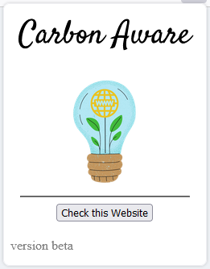
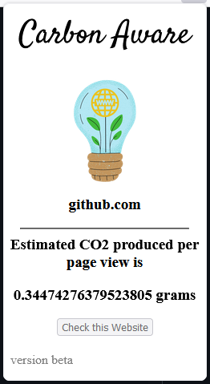

# Carbon Aware
Carbon Aware is a browser extension that displays the carbon emissions of websites you visit. With this extension, you can access the amount of carbon dioxide emitted by the website you are currently on. This information can help you make more environmentally conscious decisions when browsing the web.

 

## Installation Guide 💾
   - Prerequisite: Firefox should be installed.

1. Clone this repository or Download.

    ```sh
    git clone 
    ```

2. Open Firefox browser

3. Then type the following in the `search bar`

   ```sh
    about:debugging
   ```

4. Then click on `This Firefox`

5. Click on `Load Temporary Add-On` and go to the folder in which you have cloned this repo and add the `manifest.txt` file.


***THIS WILL ONLY WORK IN A FIREFOX BROWSER SINCE THE MANIFEST FILE IS CONFIGURED FOR IT***

## Contribution
This extension is currently only compatible with Firefox browsers. However, with some adjustments to the manifest file, it can be made to work on other browsers as well. While efforts to adapt it for use on Chrome are still in the early stages, contributions to this project would be greatly appreciated. Links to resources for getting started with Chrome extensions can be found below. Please feel free to contribute to making this extension work on Chrome and don't forget to submit a pull request with the changes. <br>
https://developer.chrome.com/docs/extensions/mv3/getstarted/ <br>
We also welcome bug reports, feature requests, and feedback. Please open an issue in this repository to report a bug or request a feature.

<hr>

__This project is still in its initial stages. Any help will be appreciated.__
